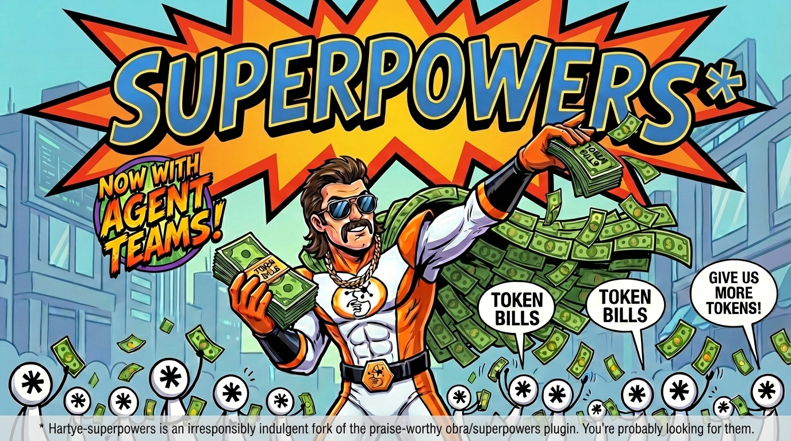

<div align="center">



</div>

# HARTYE-SUPERPOWERS

### *THE IRRESPONSIBLY INDULGENT FORK*

OH YEAH, brother! You've stumbled into the DANGER ZONE. This right here is Hartye-Superpowers — the CREAM OF THE CROP of agent workflow plugins — and it is NOT for the faint of heart!

> **STOP RIGHT THERE.** Are you a sensible, budget-conscious developer who just wants their coding agent to be better? Then you want [**obra/superpowers**](https://github.com/obra/superpowers) — Jesse Vincent's LEGENDARY original plugin. It's the real deal. The foundation. The champ that started this whole revolution. Go there. Install that. You will love it.
>
> Still here? Then you're ready for THE MADNESS. DIG IT.

## What Makes This Fork Different?

The original [obra/superpowers](https://github.com/obra/superpowers) gives your agent a disciplined, structured workflow. Beautiful. Elegant. Responsible.

This fork looked at that and said **"WHAT IF WE TURNED IT UP TO ELEVEN?"**

**AGENT TEAMS, BABY.** Multiple agents working together — a lead agent spawning teammates, assigning tasks through shared task lists, agents talking DIRECTLY to each other, each one in its own isolated git worktree so nobody steps on anybody's toes. The lead watches the board, resolves blockers, merges the branches, and delivers a finished feature while you're out getting coffee.

**MULTI-PERSPECTIVE ANALYSIS, BROTHER.** Want a second opinion on your architecture? How about FOUR second opinions? Perspective-review spawns a squad of independently-minded analysts — an Adversary looking for exploits, an Operator imagining the 3am production fire, a Performance engineer modeling 100x load — and then makes them ARGUE WITH EACH OTHER in a cross-pollination round. Novel insights the baseline brain CANNOT produce. It's like having a whole review board, except they actually read the code.

Will it consume tokens like a man possessed? **YOU BET IT WILL.** That's the price of GREATNESS. The Token Bills don't lie.

## The Workflow — OOOH YEAH

1. **BRAINSTORMING** — Your agent doesn't just dive in like some JABRONI. It stops. It asks questions. It *thinks*. Design refinement through Socratic questioning. The cream rises to the top!

2. **GIT WORKTREES** — Isolated workspace, fresh branch, clean baseline. Your main branch doesn't get touched. NOBODY touches the main branch until it's time.

3. **THE PLAN** — Every task broken down into bite-sized pieces. Exact file paths. Complete code. Verification steps. A plan so clear even a caffeinated junior dev with no context could follow it.

4. **EXECUTION** — And here's where you CHOOSE YOUR DESTINY:
   - **Subagent-Driven** — One agent per task, two-stage review. Fast. Clean. The classic.
   - **Team-Driven** — A WHOLE SQUAD of agents coordinating through direct messaging and shared task lists. Each agent gets its own worktree. The lead orchestrates. It's beautiful chaos. *(Opus 4.6+ only, and your token budget WILL feel it.)*
   - **Manual** — You execute the plan yourself in a parallel session. For the control freaks. No judgment.

5. **TEST-DRIVEN DEVELOPMENT** — RED. GREEN. REFACTOR. No exceptions. Write the test first or the skill will DELETE YOUR CODE. The Macho Man respects TDD.

6. **CODE REVIEW** — Every task gets reviewed against the plan. Critical issues BLOCK PROGRESS. No sneaking past the ropes.

7. **PERSPECTIVE REVIEW** *(optional but DEVASTATING)* — Before you even write the plan, unleash 3-4 analytical perspectives on your design. They find things independently, then CROSS-POLLINATE. The Adversary reads the Operator's concerns and goes "actually that's even worse than you think." Cascading insights. Novel attack vectors. Budget-destroying but TRUTH-REVEALING.

8. **FINISH** — Tests pass, options presented, worktree cleaned up. Merge, PR, keep, or discard. Clean as a whistle.

**These aren't suggestions. They're MANDATORY WORKFLOWS.** The skills trigger automatically. Your agent doesn't get a choice. AND NEITHER DO YOU.

## Installation

> **Seriously though** — if you want the stable, token-efficient experience, go install [obra/superpowers](https://github.com/obra/superpowers). Jesse built the foundation and it's excellent. This fork is for people who looked at that and said "but what if MORE agents?"

### Claude Code

```bash
# Add the marketplace (one-time) — SNAP INTO IT
/plugin marketplace add ehartye/hartye-claude-plugins

# Install the plugin — THE CREAM RISES TO THE TOP
/plugin install hartye-superpowers@hartye-plugins
```

### Codex

```
Fetch and follow instructions from https://raw.githubusercontent.com/ehartye/Hartye-superpowers/refs/heads/main/.codex/INSTALL.md
```

### OpenCode

```
Fetch and follow instructions from https://raw.githubusercontent.com/ehartye/Hartye-superpowers/refs/heads/main/.opencode/INSTALL.md
```

## What's Inside — THE FULL ARSENAL

**Testing**
- **test-driven-development** — RED-GREEN-REFACTOR or go home

**Debugging**
- **systematic-debugging** — 4-phase root cause analysis. No guessing.
- **verification-before-completion** — Prove it's fixed or it ain't fixed

**Analysis**
- **perspective-review** — Multi-perspective review of projects, designs, and plans. 12 analytical lenses. Cross-pollination. The full tribunal.
- **perspective-research** — Multi-perspective exploration of open questions. "Should we use X or Y?" becomes a structured debate with an ADR at the end.

**Collaboration**
- **brainstorming** — Socratic design refinement
- **writing-plans** — Battle-tested implementation plans
- **executing-plans** — Batch execution with human checkpoints
- **dispatching-parallel-agents** — Concurrent subagent workflows
- **requesting-code-review** / **receiving-code-review** — The review gauntlet
- **using-git-worktrees** — Isolated development branches
- **finishing-a-development-branch** — The clean exit
- **subagent-driven-development** — Fast iteration with two-stage review
- **team-driven-development** — THE MAIN EVENT. Agent teams with peer-to-peer messaging, shared task lists, and per-agent worktree isolation. *(Experimental. Opus 4.6+. Token-hungry. Glorious.)*

**Agents**
- **code-reviewer** — Bundled agent for systematic code review against plans and standards

**Meta**
- **writing-skills** — Create your own skills
- **using-superpowers** — The orientation guide

## Sponsorship

The original [obra/superpowers](https://github.com/obra/superpowers) is the project that made all of this possible. If Superpowers has been useful to you, consider [sponsoring Jesse Vincent](https://github.com/sponsors/obra). He built the ring. We're just here doing elbow drops off the top rope.

## Philosophy

- **Test-Driven Development** — Write the test first. ALWAYS.
- **YAGNI** — You Ain't Gonna Need It. Build what the spec says. NOTHING MORE. Gold-plating is for championship belts, not code.
- **Systematic over ad-hoc** — Process over guessing. EVERY TIME.
- **Evidence over claims** — Verify before declaring victory.
- **Diverse perspectives over groupthink** — One brain finds bugs. Four brains with different analytical procedures find FORTY-ONE PERCENT more unique defects. That's not hype, that's Basili's research.
- **Go big or go home** — If you're gonna spend tokens, MAKE THEM COUNT.

## Contributing

1. Fork [ehartye/Hartye-superpowers](https://github.com/ehartye/Hartye-superpowers)
2. Create a branch
3. Follow the `writing-skills` skill
4. Submit a PR

## License

MIT License — see LICENSE file for details

## Support

- **Issues**: <https://github.com/ehartye/Hartye-superpowers/issues>
- **The original (you probably want this)**: <https://github.com/obra/superpowers>

---

*Hartye-superpowers is an irresponsibly indulgent fork of the praise-worthy [obra/superpowers](https://github.com/obra/superpowers) plugin. You're probably looking for them.*
