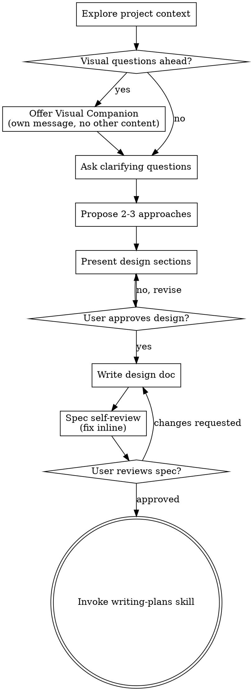

# Brainstorming Ideas Into Designs

## Overview

Help turn ideas into fully formed designs and specs through natural collaborative dialogue.

Start by understanding the current project context, then ask questions one at a time to refine the idea. Once you understand what you're building, present the design and get user approval.

<HARD-GATE>
Escalate to a design-and-approval cycle before implementing ONLY when a trigger is present (see using-superpowers → Right-Sizing Process): the work spans multiple subsystems, requirements are ambiguous, the change is hard to reverse or destructive, or the user asks to design first. When a trigger fires, do NOT invoke any implementation skill, write code, scaffold, or take implementation action until you have presented a design and the user has approved it.

Absent any trigger, do NOT gate: state a one-line intent and implement directly under the discipline (test-driven-development, systematic-debugging, verification-before-completion). In autonomous/headless runs with no user to approve, never stall — state your assumptions and proceed.
</HARD-GATE>

## Anti-Pattern: Mis-Sizing The Ceremony

Two failure modes, opposite directions:

- **Over-ceremony:** forcing design-and-approval onto a task with no trigger (a one-line helper, a config tweak, a rename). Wasted work, and in autonomous runs it can stall the task entirely. State a one-line intent and implement with discipline.
- **Under-design:** treating a triggered task as trivial because it *looks* small. If the work spans subsystems, the requirements are ambiguous, or the change is hard to reverse, it is not trivial — present a design and get approval, even if the code is short.

When unsure, start low and let a trigger escalate you: the moment a hidden design question, a second subsystem, or an irreversible step appears, stop and move to design.

## Checklist

You MUST create a task for each of these items and complete them in order:

1. **Explore project context** — check files, docs, recent commits
2. **Offer visual companion** (if topic will involve visual questions) — its own message, not combined with a clarifying question. See the Visual Companion section below.
3. **Ask clarifying questions** — one at a time, understand purpose/constraints/success criteria
4. **Propose 2-3 approaches** — with trade-offs and your recommendation
5. **Present design** — in sections scaled to their complexity, get user approval after each section
6. **Write design doc** — save to `docs/superpowers/specs/YYYY-MM-DD-<topic>-design.md` and commit
7. **Spec self-review** — quick inline check for placeholders, consistency, scope, ambiguity, YAGNI (see below)
8. **User reviews written spec** — ask user to review the spec file before proceeding
9. **Transition to implementation** — invoke writing-plans skill to create implementation plan

## Process Flow

**The terminal state is invoking writing-plans.** Do NOT invoke any domain-specific implementation skill (e.g., UI builders, scaffolding tools). The ONLY skill you invoke after brainstorming is writing-plans.

## The Process

**Understanding the idea:**
- Check out the current project state first (files, docs, recent commits)
- Before asking detailed questions, assess scope: if the request describes multiple independent subsystems (e.g., "build a platform with chat, file storage, billing, and analytics"), flag this immediately. Don't spend questions refining details of a project that needs to be decomposed first.
- If the project is too large for a single spec, help the user decompose into sub-projects: what are the independent pieces, how do they relate, what order should they be built? Then brainstorm the first sub-project through the normal design flow. Each sub-project gets its own spec → plan → implementation cycle.
- Ask questions one at a time to refine the idea
- Prefer multiple choice questions when possible, but open-ended is fine too
- Only one question per message - if a topic needs more exploration, break it into multiple questions
- Focus on understanding: purpose, constraints, success criteria

**Exploring approaches:**
- Propose 2-3 different approaches with trade-offs
- Present options conversationally with your recommendation and reasoning
- Lead with your recommended option and explain why

**Presenting the design:**
- Once you believe you understand what you're building, present the design
- Scale each section to its complexity: a few sentences if straightforward, up to 200-300 words if nuanced
- Ask after each section whether it looks right so far
- Cover: architecture, components, data flow, error handling, testing
- Be ready to go back and clarify if something doesn't make sense

**Design for isolation and clarity:**

- Break the system into smaller units that each have one clear purpose, communicate through well-defined interfaces, and can be understood and tested independently.
- For each unit, you should be able to answer: what does it do, how do you use it, and what does it depend on?
- Can someone understand what a unit does without reading its internals? Can you change the internals without breaking consumers? If not, the boundaries need work.
- Smaller, well-bounded units are also easier for you to work with — you reason better about code you can hold in context at once, and your edits are more reliable when files are focused. When a file grows large, that's often a signal that it's doing too much.

**Working in existing codebases:**

- Explore the current structure before proposing changes. Follow existing patterns.
- Where existing code has problems that affect the work (e.g., a file that's grown too large, unclear boundaries, tangled responsibilities), include targeted improvements as part of the design — the way a good developer improves code they're working in.
- Don't propose unrelated refactoring. Stay focused on what serves the current goal.

## After the Design

**Documentation:**
- Write the validated design to `docs/superpowers/specs/YYYY-MM-DD-<topic>-design.md`
- Use elements-of-style:writing-clearly-and-concisely skill if available
- Commit the design document to git

**Spec Self-Review:**
After writing the spec document, look at it with fresh eyes. **Calibration:** only flag issues that would cause real problems during implementation planning — stylistic preferences, minor wording, and "this section could be longer" don't count. Fix or skip them silently.

1. **Placeholder scan:** Any "TBD", "TODO", incomplete sections, or vague requirements? Fix them.
2. **Internal consistency:** Do any sections contradict each other? Does the architecture match the feature descriptions?
3. **Scope check:** Is this focused enough for a single implementation plan, or does it need decomposition?
4. **Ambiguity check:** Could any requirement be interpreted two different ways? If so, pick one and make it explicit.
5. **YAGNI check:** Any unrequested features, premature abstractions, or over-engineering? Cut them.

Fix any real issues inline. No need to re-review — just fix and move on.

**User Review Gate:**
After the spec self-review, ask the user to review the written spec file before proceeding to writing-plans. The user may have caught something the design conversation missed once they see it on paper.

**Implementation:**
- Once the user approves the spec, invoke the writing-plans skill to create a detailed implementation plan
- Do NOT invoke any other skill. writing-plans is the next step.

## Key Principles

- **One question at a time** - Don't overwhelm with multiple questions
- **Multiple choice preferred** - Easier to answer than open-ended when possible
- **YAGNI ruthlessly** - Remove unnecessary features from all designs
- **Explore alternatives** - Always propose 2-3 approaches before settling
- **Incremental validation** - Present design, get approval before moving on
- **Be flexible** - Go back and clarify when something doesn't make sense

## Visual Companion

A browser-based companion for showing mockups, diagrams, and visual options during brainstorming. It's a tool, not a mode — accepting the companion means it's available for questions that benefit from visual treatment, not that every question goes through the browser.

**Offering the companion:** When upcoming questions are likely to involve visual content (mockups, layouts, diagrams), offer it once for consent:

> "Some of what we're working on might be easier to explain if I can show it to you in a web browser. I can put together mockups, diagrams, comparisons, and other visuals as we go. This feature is still new and can be token-intensive. Want to try it? (Requires opening a local URL)"

**Make this offer its own message.** No clarifying questions, no context summary, no other content alongside it — just the offer, then wait for the user's response. If they decline, continue with text-only brainstorming.

**Per-question decision:** Even after the user accepts, decide for each question whether to use the browser or the terminal. The test: **would the user understand this better by seeing it than reading it?**

- **Use the browser** for content that is visual — mockups, wireframes, layout comparisons, architecture diagrams, side-by-side visual designs
- **Use the terminal** for content that is text — requirements questions, conceptual choices, tradeoff lists, A/B/C/D text options, scope decisions

A question *about* a UI topic isn't automatically a visual question. "What does personality mean in this context?" is conceptual — use the terminal. "Which wizard layout works better?" is visual — use the browser.

If the user agrees to the companion, read the full guide before proceeding:
`skills/brainstorming/visual-companion.md`

## Integration

**Invoked by:** User directly (entry point for creative work)

**Hands off to:**
- **h-superpowers:writing-plans** - Creates implementation plan from the approved design

**Optional companion:**
- **Visual companion** (this skill directory) — browser-based mockup/diagram tool for visual questions. See `visual-companion.md`.
