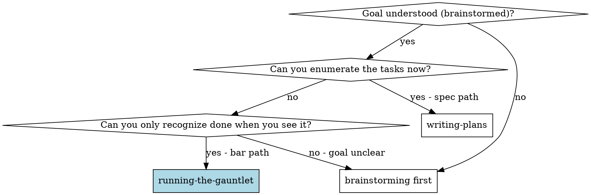
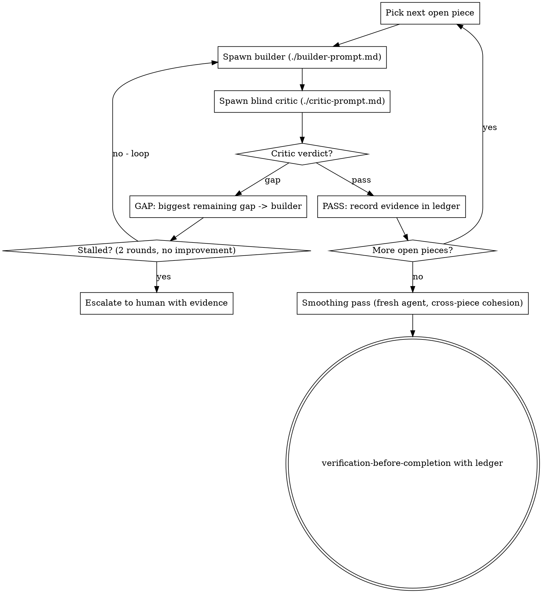

# Running the Gauntlet

Define what done *looks like* as ratified, inspectable artifacts (the **bar**),
then loop builder and blind-critic agents against that frozen bar until the
critic — who never built the thing — is satisfied. Every verdict is backed by
perceived evidence: screenshots, test output, audit results.

**This is TDD generalized to qualities tests can't express.** The bar is the
failing test written first (RED). The loop runs until GREEN. The critic, not
the builder, owns the verdict.

**Announce at start:** "I'm using the running-the-gauntlet skill. Phase 1:
defining the bar."

**Core principle:** Materialize the bar → human ratifies → bar freezes →
builders build, blind critics perceive and judge → loop until pass, stall,
or budget — never until the builder "feels done."

## When to Use

**Rubric:** Can you enumerate the tasks? → writing-plans. Can you only
recognize done when you see it? → gauntlet.

Typical bar-path goals: "as polished as X", "the UI is complete and looks
intended", "matches these mockups", "adheres to our stack's best practices",
"a game that feels like Y". Typical spec-path goals: features with knowable
task lists — use writing-plans, don't pay for a gauntlet.

**Composition note (hybrid):** For large builds you can plan the structure
with writing-plans and use a bar as the *exit gate* — run Phase 1 here, then
execute the plan normally, then run Phase 2 as the completion check. Don't
mix the loops mid-task.

## The Bar Contract

Four invariants. If any fails, the gauntlet refuses to start:

1. **Materialized** — artifacts on disk in
   `docs/superpowers/bars/YYYY-MM-DD-<goal>/`, indexed by `bar.md`.
2. **Perceivable** — a critic can run it, render it, or check it. Prose
   aspirations ("production quality") don't qualify.
3. **Ratified** — the human approved the bar. This is the cheap steering
   moment; the expensive loop never runs against an unapproved ideal.
4. **Frozen** — mid-loop the builder cannot renegotiate. "The bar is wrong
   here" goes to `deviations.md` for the human, work continues elsewhere.

Bar component types, required manifest fields, and pass semantics
(parity vs. aspirational scoring): read `./bar-types.md`.

## Checklist

You MUST create a task for each of these items and complete them in order:

1. **Phase 1: Define the bar** — follow `./bar-definition.md` (stack
   grounding first for UX bars)
2. **Ratification checkpoint** — human approves; bar freezes; commit the bar
3. **Decompose into judgeable pieces** — one piece = one thing a critic can
   pass/fail independently
4. **Phase 2: Run the loop** — builder → blind critic per piece, until PASS /
   stall / budget
5. **Smoothing pass** — fresh agent checks cross-piece cohesion
6. **Evidence ledger complete** — then verification-before-completion

## Phase 1: Define the Bar

Follow `./bar-definition.md`. Summary:

- **UX bars:** stack grounding FIRST (framework, component vocabulary, design
  tokens, platform constraints) → mockups generated under the grounding →
  cheap mini-gauntlet on the mockups → state matrix (screens × {empty,
  loading, error, long-content, responsive, denied}) → ratify.
- **Exemplar bars:** materialize the reference (screenshots, samples) into
  the bar directory. Choose pass semantics: parity or aspirational threshold.
- **Practices bars:** compile a stack-specific checklist from authoritative
  sources; every item independently checkable.
- **Executable bars:** the test suite / thresholds themselves.

**Ratification gate:** Present the bar to the human (use brainstorming's
visual companion for visual bars when available). They edit, veto, approve.
On approval, commit the bar directory. The bar is now FROZEN.

In autonomous/headless runs with no human available: state the bar and your
most reasonable assumptions explicitly, mark the manifest `ratified-by:
assumed (headless)`, and proceed — never stall waiting for approval that
cannot come.

## Phase 2: The Loop

**Dispatch mechanics:** same Agent-tool patterns as
subagent-driven-development — fresh subagent per builder round and per critic
round. Independent pieces may run in parallel (fan out builders); respect the
same ≤6 concurrent agents guardrail. This skill adds roles, prompts, and loop
rules — not new orchestration machinery.

**The blindness rule (never break this):** the critic receives the goal, the
bar artifacts, and the *actual perceived output* — it runs the tests itself,
launches and screenshots the app itself. It NEVER receives the builder's
narration, summary, or commit messages. A critic that reads the builder's
self-report is judging fiction.

**Structured verdict:** every critic returns exactly one of
- `PASS` + evidence paths
- `GAP` + {biggest remaining gap, severity, evidence paths, score if
  aspirational}

One gap per round — the biggest. A laundry list dilutes the loop; the point
is ratcheting.

**Stop conditions (per piece):**
- **PASS** — critic satisfied per the bar's pass semantics.
- **Stall** — 2 consecutive rounds with no critic-acknowledged improvement
  (aspirational: score not rising). Escalate to the human with the evidence
  trail; they lower the threshold, accept as-is, fund more rounds, or file a
  deviation. Never silently keep burning rounds.
- **Budget** — the cap from `bar.md` is reached. Report honestly which pieces
  passed and which didn't.

**Deviation protocol:** builder believes a bar item is infeasible or wrong →
append to `deviations.md` (item, why, proposed alternative), continue other
pieces, human resolves at the next checkpoint. Done is never quietly
redefined.

**Evidence ledger:** `ledger.md` in the bar directory — per piece: rounds
run, final verdict, evidence paths (side-by-side screenshots, test output,
audit results). The ledger IS the input to verification-before-completion.
No ledger entry, no done claim.

## Rationalizations That Kill Gauntlets

| Thought | What's actually happening |
|---------|---------|
| "The bar's obviously met, skip the critic" | Builder judging own work — the exact failure this skill exists to prevent. |
| "I'll summarize my changes for the critic" | Blindness broken. The critic perceives the artifact or the verdict is worthless. |
| "The mockup is unrealistic, I'll just build what makes sense" | Silent bar renegotiation. File a deviation. |
| "One more round will crack it" (round 5 of a stall) | Stall rule exists because plateaus are real. Escalate with evidence. |
| "Close enough on the last two pieces" | Report honestly: which passed, which didn't. Partial pass is a legitimate, *stated* outcome. |
| "Skip ratification, the user will like it" | The expensive loop must never run against an unapproved ideal. |

## Hard Rules

- No loop before ratification. No exceptions.
- Critic never sees builder narration.
- One biggest-gap per round, not a laundry list.
- Frozen bar: deviations are filed, never absorbed.
- Stall → escalate; budget → honest partial report.
- Evidence ledger before any done claim.
- Don't exceed 6 concurrent agents.

## Integration

**Invoked after:**
- **h-superpowers:brainstorming** — the bar path from its terminal fork
- User directly — "make it as good as X", "gauntlet this"

**Uses:**
- **h-superpowers:using-git-worktrees** — isolated workspace before building
- **h-superpowers:test-driven-development** — builders follow TDD for all code
- **h-superpowers:verification-before-completion** — consumes the evidence ledger
- **h-superpowers:finishing-a-development-branch** — after the ledger is complete

**Alternative:**
- **h-superpowers:writing-plans** — when tasks are enumerable (spec path)
