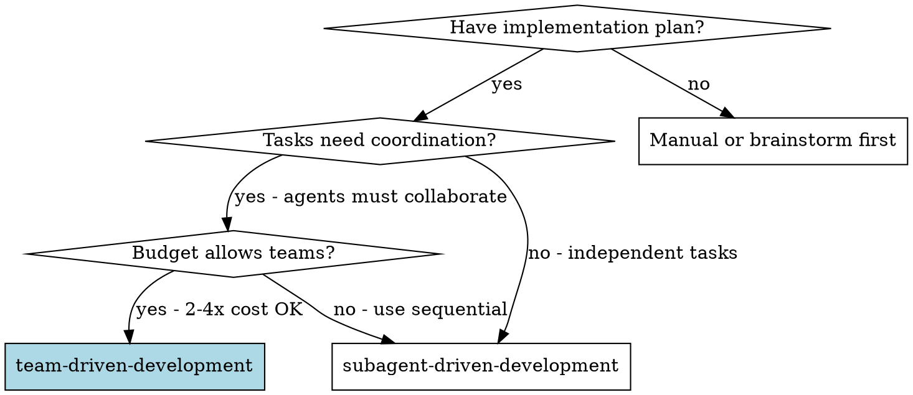
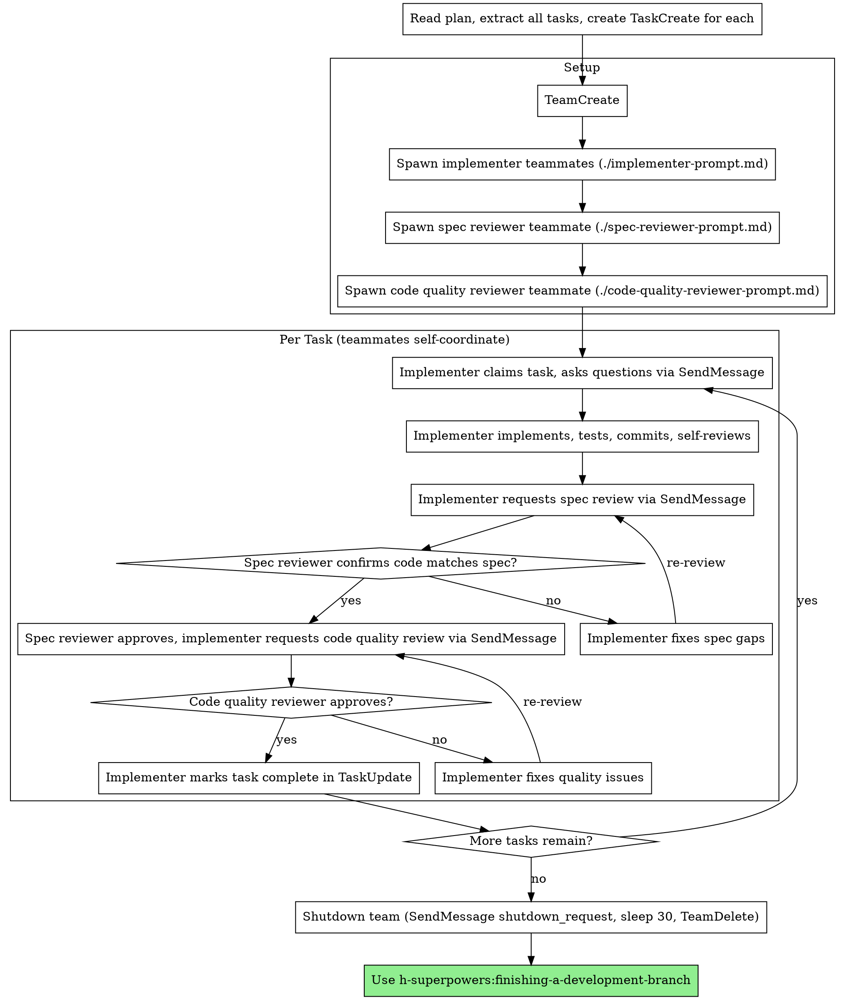

# Team-Driven Development

Execute plan by spawning persistent teammate agents that collaborate via shared task list and direct messaging, with two-stage review after each task: spec compliance review first, then code quality review.

**Core principle:** Persistent teammates + shared task list + direct messaging + two-stage review (spec then quality) = high quality, parallel execution

**EXPERIMENTAL:** Requires Claude Code with Opus 4.6+ and `CLAUDE_CODE_EXPERIMENTAL_AGENT_TEAMS=1`

## When to Use



**vs. Subagent-Driven Development (sequential):**
- Persistent teammates (context preserved across tasks)
- Parallel execution (multiple tasks simultaneously)
- Direct peer-to-peer messaging (not just hub-and-spoke)
- Two-stage review after each task: spec compliance first, then code quality
- 2-4x more expensive (each teammate is a full Claude session)

## The Process



## Prompt Templates

- `./implementer-prompt.md` - Spawn implementer teammate
- `./spec-reviewer-prompt.md` - Spawn spec compliance reviewer teammate
- `./code-quality-reviewer-prompt.md` - Spawn code quality reviewer teammate

### Teammate naming

Give each teammate a **semantic name** that reflects their focus area or personality — never use numbered names like `implementer-1`. Good names make message logs readable and give each teammate a distinct identity.

- **Implementers:** Name after their focus — `hook-installer`, `api-layer`, `ui-dashboard`, `test-harness`, `schema-migrator`
- **Spec reviewer:** Name after their adversarial role — `spec-auditor`, `requirements-checker`, `compliance-eye`
- **Code quality reviewer:** Name after their quality focus — `quality-sentinel`, `code-critic`, `standards-keeper`

Pick names that fit the project. Be creative — the only constraint is that the name should be recognizable in message logs.

### Role summaries

**Implementer self-review:** Before requesting review, implementers review their own work for completeness (all requirements met?), quality (clear naming, clean code?), discipline (no overbuilding, follows existing patterns?), and testing (tests verify real behavior, not just mock it?). Issues found during self-review are fixed before handoff to reviewers.

**Spec reviewer mindset:** Adversarial — does not trust the implementer's report. The reviewer reads code independently, compares against the spec line-by-line, and treats the implementer's claims as unverified until confirmed by code inspection. Checks three things: (1) missing requirements — did they skip anything? (2) extra work — did they build things not in spec? (3) misunderstandings — did they solve the wrong problem?

**Code quality reviewer:** Only reviews after spec compliance passes. Reviews the diff for clean code, test coverage, maintainability, and adherence to project conventions. Returns strengths, issues (critical/important/minor), and an overall assessment.

**Lead (you):** Orchestrates via native tools — `TeamCreate`, `TaskCreate`, `TaskUpdate` (assign owners), `SendMessage` (coordinate), `TeamDelete` (cleanup). Does NOT implement. Monitors `TaskList`, resolves conflicts, enforces quality gates, shuts down team when done.

## Example Workflow

```
You: I'm using Team-Driven Development to execute this plan.

[Read plan file once: docs/plans/feature-plan.md]
[Extract all 5 tasks with full text and context]
[TeamCreate(team_name: "feature-plan", description: "Implementing feature plan")]
[TaskCreate for each task, TaskUpdate to set dependencies]

[Read ./implementer-prompt.md, fill in team context]
[Spawn hook-installer (implementer, focus: hook setup) via Agent tool with team_name]
[Spawn recovery-builder (implementer, focus: recovery modes) via Agent tool with team_name]
[Read ./spec-reviewer-prompt.md, fill in team context]
[Spawn spec-auditor (spec reviewer) via Agent tool with team_name]
[Read ./code-quality-reviewer-prompt.md, fill in team context]
[Spawn quality-sentinel (code quality reviewer) via Agent tool with team_name]

[Monitor TaskList, respond to messages]

Task 1: Hook installation script

hook-installer claims task-1, messages you:
  "Before I begin - should the hook be installed at user or system level?"

You reply via SendMessage:
  "User level (~/.config/superpowers/hooks/)"

hook-installer: "Got it. Implementing now..."
[Later] hook-installer messages spec-auditor:
  - Implemented install-hook command
  - Added tests, 5/5 passing
  - Self-review: Found I missed --force flag, added it
  - Committed
  - Please review spec compliance

spec-auditor messages hook-installer:
  ✅ Spec compliant - all requirements met, nothing extra

hook-installer messages quality-sentinel:
  Please review code quality

quality-sentinel messages hook-installer:
  Strengths: Good test coverage, clean. Issues: None. Approved.

[hook-installer marks task-1 complete via TaskUpdate]

Task 2: Recovery modes (meanwhile, recovery-builder is working on task-3 in parallel)

hook-installer claims task-2, proceeds without questions:
  - Added verify/repair modes
  - 8/8 tests passing
  - Self-review: All good
  - Committed

spec-auditor messages hook-installer:
  ❌ Issues:
  - Missing: Progress reporting (spec says "report every 100 items")
  - Extra: Added --json flag (not requested)

[hook-installer fixes, requests re-review]

spec-auditor: ✅ Spec compliant now

quality-sentinel: Strengths: Solid. Issues (Important): Magic number (100)

[hook-installer fixes, requests re-review]

quality-sentinel: ✅ Approved

[hook-installer marks task-2 complete]

...

[All tasks complete — TaskList confirms all status: completed]
[Run full test suite]
[Send shutdown_request to all teammates]
[Bash("sleep 30")]
[TeamDelete]
[Use finishing-a-development-branch — handles merge, tests, worktree cleanup, and disposition]
```

## Worktree Completion

After all tasks are complete and shutdown is done, invoke `h-superpowers:finishing-a-development-branch`.
That skill handles merge, test verification, worktree cleanup, and final disposition (push, PR, keep, discard). **Do not duplicate those steps here** — just invoke the skill and follow its instructions.

**⚠️ CWD warning:** If your shell is inside the worktree, `finishing-a-development-branch` will `cd` to the main repo before removing it. If you do any manual cleanup yourself, always `cd` out of the worktree before `git worktree remove`.

## Completion and Shutdown

**When all tasks are complete, execute this immediately. No exceptions.**

1. Call `TaskList` to confirm every task shows status `completed`.
2. Run the full test suite to verify the final result.
3. Send `shutdown_request` to each teammate via SendMessage.
4. Call `Bash("sleep 30")`. One wait. Do not send further messages, do not loop, do not check on teammates. They either shut down in 30 seconds or they don't.
5. Call `TeamDelete`. If it fails, call `Bash("sleep 30")` and retry **once**. No other fallback — `TeamDelete` is the only path to a clean exit (it terminates agent processes; `rm -rf` leaves orphans that prevent the CLI from exiting).
6. Summarize what was accomplished to the user.

**Hard stop.** After step 3, the orchestration is over. No coordination messages, no "are you still there?", no additional review cycles. Shut down and get out.

## Advantages

**vs. Manual execution:**
- Teammates follow TDD naturally
- Persistent context per agent (no confusion across tasks)
- Parallel execution (multiple tasks at once)
- Teammates can ask questions (before AND during work)

**vs. Subagent-Driven Development:**
- Parallel execution (wall-clock time savings)
- Direct peer messaging (not just hub-and-spoke)
- Persistent context (agent remembers earlier tasks)
- Collaborative review (discussion, not just pass/fail)

**Quality gates:**
- Self-review catches issues before handoff
- Two-stage review: spec compliance, then code quality
- Review loops ensure fixes actually work
- Spec compliance prevents over/under-building
- Code quality ensures implementation is well-built

**Cost:**
- Each teammate is a full Claude session (2-4x more than subagents)
- Message overhead adds to cost
- But parallel execution saves wall-clock time
- And catches issues early (cheaper than debugging later)

## Red Flags

**Never:**
- Start implementation on main/master branch without explicit user consent
- Skip reviews (spec compliance OR code quality)
- Proceed with unfixed issues
- Exceed 6 agents (coordination overhead too high)
- Ignore messages from teammates (breaks collaboration)
- Let implementer mark task complete before reviewer approves
- **Start code quality review before spec compliance is ✅** (wrong order)
- Move to next task while either review has open issues
- Forget to budget for full sessions per agent

**If teammate asks questions:**
- Answer clearly and completely via SendMessage
- Provide additional context if needed
- Don't rush them into implementation

**If reviewer finds issues:**
- Implementer fixes them
- Reviewer reviews again
- Repeat until approved
- Don't skip the re-review

**If teammate fails task:**
- Send fix instructions via SendMessage
- Don't try to fix manually (you're the lead, not the implementer)

## Integration

**Required workflow skills:**
- **h-superpowers:using-git-worktrees** - REQUIRED: Set up isolated workspace before starting
- **h-superpowers:writing-plans** - Creates the plan this skill executes
- **h-superpowers:requesting-code-review** - Code review template for reviewer teammates
- **h-superpowers:finishing-a-development-branch** - Complete development after all tasks

**Teammates follow:**
- **h-superpowers:test-driven-development** - TDD is baked into implementer prompts (red-green-refactor, Iron Law)

**Alternative workflow:**
- **h-superpowers:subagent-driven-development** - Use for independent sequential tasks instead
- **h-superpowers:executing-plans** - Use for parallel session instead of same-session execution
