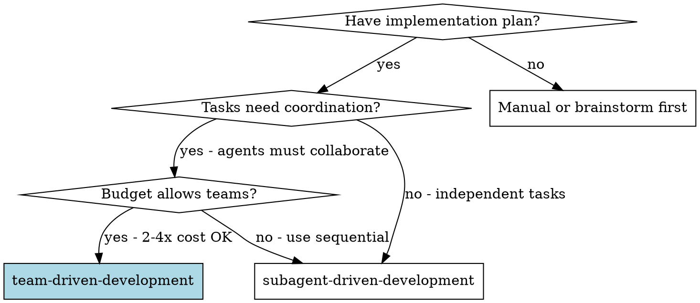
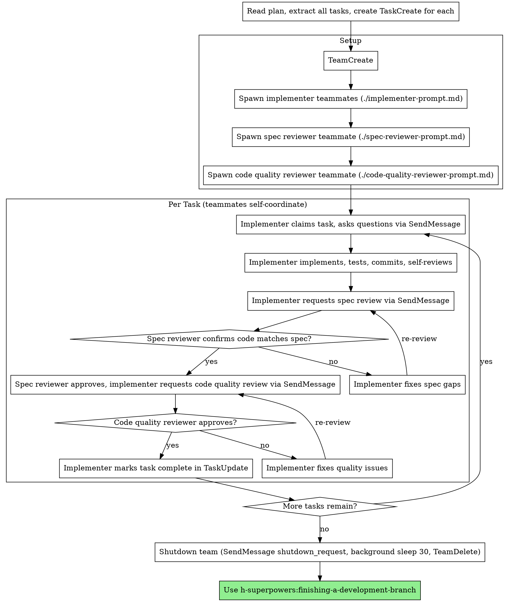

# Team-Driven Development

Execute plan by spawning persistent teammate agents that collaborate via shared task list and direct messaging, with two-stage review after each task: spec compliance review first, then code quality review.

**Why teammates:** You coordinate persistent specialized agents that collaborate through a shared task list and direct messaging. Each teammate works in isolated context you help shape; they don't inherit your history. This preserves your context for coordination and lets independent work proceed in parallel.

**Core principle:** Persistent teammates + shared task list + direct messaging + two-stage review (spec then quality) = high quality, parallel execution

**Continuous execution:** Teammates keep pulling tasks from the shared list until none remain — they don't pause to ask "should I continue?" between tasks. The lead stops the flow only for an unresolvable BLOCKED status, genuine ambiguity, or completion of all tasks.

**EXPERIMENTAL:** Requires Claude Code with Opus 4.6+ and `CLAUDE_CODE_EXPERIMENTAL_AGENT_TEAMS=1`

## When to Use



**vs. Subagent-Driven Development (sequential):**
- Persistent teammates (context preserved across tasks)
- Parallel execution (multiple tasks simultaneously)
- Direct peer-to-peer messaging (not just hub-and-spoke)
- Two-stage review after each task: spec compliance first, then code quality
- 2-4x more expensive (each teammate is a full Claude session)

## The Process



## Model Selection

Use the least powerful model that can handle each teammate's role, to conserve cost and increase speed.

- **Mechanical implementer teammate** (isolated functions, clear spec, 1–2 files): a fast, cheap model. Most well-specified implementation tasks are mechanical.
- **Integration / debugging teammate** (multi-file coordination, pattern matching): a standard model.
- **Architecture, design, and review teammate**: the most capable available model.

Complexity signals: touches 1–2 files with a complete spec → cheap; multiple files with integration concerns → standard; requires design judgment or broad codebase understanding → most capable.

## Handling Teammate Status

Implementer teammates report one of four statuses to the lead via `SendMessage`, and reflect it in the shared task list (`TaskUpdate`). The lead handles each:

- **DONE** — proceed to spec compliance review.
- **DONE_WITH_CONCERNS** — read the concerns before proceeding. If they bear on correctness or scope, address them before review; if they're observations (e.g., "this file is getting large"), note and proceed to review.
- **NEEDS_CONTEXT** — the teammate is missing information that wasn't provided. Send it via `SendMessage` and let them continue.
- **BLOCKED** — assess the blocker: (1) context problem → send more context; (2) needs more reasoning → reassign to a more capable model; (3) task too large → split it into smaller shared-list tasks; (4) the plan itself is wrong → escalate to the human.

**Never** ignore an escalation or force the same model to retry without changes. If a teammate is stuck, something must change before retrying.

## Prompt Templates

- `./implementer-prompt.md` - Spawn implementer teammate
- `./spec-reviewer-prompt.md` - Spawn spec compliance reviewer teammate
- `./code-quality-reviewer-prompt.md` - Spawn code quality reviewer teammate

### Teammate naming

Give each teammate a **semantic name** that reflects their focus area or personality — never use numbered names like `implementer-1`. Good names make message logs readable and give each teammate a distinct identity.

- **Implementers:** Name after their focus — `hook-installer`, `api-layer`, `ui-dashboard`, `test-harness`, `schema-migrator`
- **Spec reviewer:** Name after their adversarial role — `spec-auditor`, `requirements-checker`, `compliance-eye`
- **Code quality reviewer:** Name after their quality focus — `quality-sentinel`, `code-critic`, `standards-keeper`

Pick names that fit the project. Be creative — the only constraint is that the name should be recognizable in message logs.

### Role summaries

**Implementer self-review:** Before requesting review, implementers review their own work for completeness (all requirements met?), quality (clear naming, clean code?), discipline (no overbuilding, follows existing patterns?), and testing (tests verify real behavior, not just mock it?). Issues found during self-review are fixed before handoff to reviewers.

**Spec reviewer mindset:** Independent verification — reads code directly against the spec rather than taking the implementer's summary on faith. Not adversarial, just complementary: authors are the least likely people to catch what they missed. Checks three things: (1) missing requirements — did anything get skipped? (2) extra work — did anything not in spec get built? (3) misunderstandings — was the wrong problem solved?

**Code quality reviewer:** Only reviews after spec compliance passes. Reviews the diff for clean code, test coverage, maintainability, and adherence to project conventions. Returns strengths, issues (critical/important/minor), and an overall assessment.

**Lead (you):** Orchestrates via native tools — `TeamCreate`, `TaskCreate`, `TaskUpdate` (assign owners), `SendMessage` (coordinate), `TeamDelete` (cleanup). Does NOT implement. Monitors `TaskList`, resolves conflicts, enforces quality gates, shuts down team when done.

## Example Workflow

```
You: I'm using Team-Driven Development to execute this plan.

[Read plan file once: docs/superpowers/plans/feature-plan.md]
[Extract all 5 tasks with full text and context]
[TeamCreate(team_name: "feature-plan", description: "Implementing feature plan")]
[TaskCreate for each task, TaskUpdate to set dependencies]

[Read ./implementer-prompt.md, fill in team context]
[Spawn hook-installer (implementer, focus: hook setup) via Agent tool with team_name]
[Spawn recovery-builder (implementer, focus: recovery modes) via Agent tool with team_name]
[Read ./spec-reviewer-prompt.md, fill in team context]
[Spawn spec-auditor (spec reviewer) via Agent tool with team_name]
[Read ./code-quality-reviewer-prompt.md, fill in team context]
[Spawn quality-sentinel (code quality reviewer) via Agent tool with team_name]

[Monitor TaskList, respond to messages]

Task 1: Hook installation script

hook-installer claims task-1, messages you:
  "Before I begin - should the hook be installed at user or system level?"

You reply via SendMessage:
  "User level (~/.config/superpowers/hooks/)"

hook-installer: "Got it. Implementing now..."
[Later] hook-installer messages spec-auditor:
  - Implemented install-hook command
  - Added tests, 5/5 passing
  - Self-review: Found I missed --force flag, added it
  - Committed
  - Please review spec compliance

spec-auditor messages hook-installer:
  ✅ Spec compliant - all requirements met, nothing extra

hook-installer messages quality-sentinel:
  Please review code quality

quality-sentinel messages hook-installer:
  Strengths: Good test coverage, clean. Issues: None. Approved.

[hook-installer marks task-1 complete via TaskUpdate]

Task 2: Recovery modes (meanwhile, recovery-builder is working on task-3 in parallel)

hook-installer claims task-2, proceeds without questions:
  - Added verify/repair modes
  - 8/8 tests passing
  - Self-review: All good
  - Committed

spec-auditor messages hook-installer:
  ❌ Issues:
  - Missing: Progress reporting (spec says "report every 100 items")
  - Extra: Added --json flag (not requested)

[hook-installer fixes, requests re-review]

spec-auditor: ✅ Spec compliant now

quality-sentinel: Strengths: Solid. Issues (Important): Magic number (100)

[hook-installer fixes, requests re-review]

quality-sentinel: ✅ Approved

[hook-installer marks task-2 complete]

...

[All tasks complete — TaskList confirms all status: completed]
[Run full test suite]
[SendMessage(to: "hook-installer", message: "shutdown_request")]
[SendMessage(to: "recovery-builder", message: "shutdown_request")]
[SendMessage(to: "spec-auditor", message: "shutdown_request")]
[SendMessage(to: "quality-sentinel", message: "shutdown_request")]
[Bash("sleep 30", run_in_background=true)]  # wait for the completion notification, then continue
[TeamDelete]
[Use finishing-a-development-branch — handles merge, tests, worktree cleanup, and disposition]
```

## Worktree Completion

Workspace **setup** goes through `h-superpowers:using-git-worktrees` (native `EnterWorktree`). **Teardown is deferred** to `finishing-a-development-branch` — do not remove the worktree here.

After all tasks are complete and shutdown is done, invoke `h-superpowers:finishing-a-development-branch`.
That skill handles merge, test verification, worktree teardown (via native `ExitWorktree`, with a manual `git worktree remove` fallback), and final disposition (push, PR, keep, discard). **Do not duplicate those steps here** — just invoke the skill and follow its instructions.

**⚠️ CWD warning (manual-git fallback only):** If a worktree was created via the manual git fallback (not native `EnterWorktree`/`ExitWorktree`) and your shell is inside it, always `cd` out of the worktree to the main repo before any manual `git worktree remove` — removing the CWD invalidates the shell. Native `ExitWorktree` handles this for you.

## Completion and Shutdown

**When all tasks are complete, execute this immediately. No exceptions.**

1. Call `TaskList` to confirm every task shows status `completed`.
2. Run the full test suite to verify the final result.
3. Send `shutdown_request` to each teammate individually via `SendMessage`. **Do not broadcast** — `SendMessage` does not support `to: "*"` and will error. Send one message per teammate by name.
4. Call `Bash("sleep 30", run_in_background=true)`. One wait. The harness blocks standalone/leading `sleep` calls, so the sleep must be backgrounded — you'll get a completion notification ~30s later. Do not send further messages, do not loop, do not check on teammates. They either shut down in 30 seconds or they don't.
5. Call `TeamDelete`. If it fails, call `Bash("sleep 30", run_in_background=true)` and retry **once** after the notification. No other fallback — `TeamDelete` is the only path to a clean exit (it terminates agent processes; `rm -rf` leaves orphans that prevent the CLI from exiting).
6. Summarize what was accomplished to the user.

**Hard stop.** After step 3, the orchestration is over. No coordination messages, no "are you still there?", no additional review cycles. Shut down and get out.

## Advantages

**vs. Manual execution:**
- Teammates follow TDD naturally
- Persistent context per agent (no confusion across tasks)
- Parallel execution (multiple tasks at once)
- Teammates can ask questions (before AND during work)

**vs. Subagent-Driven Development:**
- Parallel execution (wall-clock time savings)
- Direct peer messaging (not just hub-and-spoke)
- Persistent context (agent remembers earlier tasks)
- Collaborative review (discussion, not just pass/fail)

**Quality gates:**
- Self-review catches issues before handoff
- Two-stage review: spec compliance, then code quality
- Review loops ensure fixes actually work
- Spec compliance prevents over/under-building
- Code quality ensures implementation is well-built

**Cost:**
- Each teammate is a full Claude session (2-4x more than subagents)
- Message overhead adds to cost
- But parallel execution saves wall-clock time
- And catches issues early (cheaper than debugging later)

## Hard Rules

These are the guardrails the workflow depends on — skipping any of them breaks the quality guarantees of the skill:

- Don't start implementation on main/master branch without explicit user consent
- Don't skip reviews (spec compliance OR code quality)
- Don't proceed with unfixed issues
- Don't exceed 6 agents (coordination overhead gets too high)
- Don't ignore messages from teammates — that breaks collaboration
- Don't let an implementer mark a task complete before the reviewer approves
- **Don't start code quality review before spec compliance is ✅** — wrong order
- Don't move to the next task while either review has open issues
- Budget for full sessions per agent before spawning the team

**If a teammate asks questions:**
- Answer clearly and completely via SendMessage
- Provide additional context if needed
- Don't rush them into implementation

**If a reviewer finds issues:**
- Implementer fixes them
- Reviewer reviews again
- Repeat until approved — don't skip the re-review

**If a teammate fails a task:**
- Send fix instructions via SendMessage
- Don't try to fix manually (you're the lead, not the implementer)

## Integration

**Required workflow skills:**
- **h-superpowers:using-git-worktrees** - REQUIRED: Set up isolated workspace before starting (native `EnterWorktree`)
- **h-superpowers:writing-plans** - Creates the plan this skill executes
- **h-superpowers:requesting-code-review** - Code review template for reviewer teammates
- **h-superpowers:finishing-a-development-branch** - Complete development after all tasks; handles worktree teardown via `ExitWorktree`

**Teammates follow:**
- **h-superpowers:test-driven-development** - TDD is baked into implementer prompts (red-green-refactor, Prime Directive)
- **h-superpowers:verification-before-completion** - Evidence before completion claims, baked into implementer self-review

**Alternative workflow:**
- **h-superpowers:subagent-driven-development** - Use for independent sequential tasks instead
- **h-superpowers:executing-plans** - Use for inline, no-subagent execution in this session (simpler fallback)
